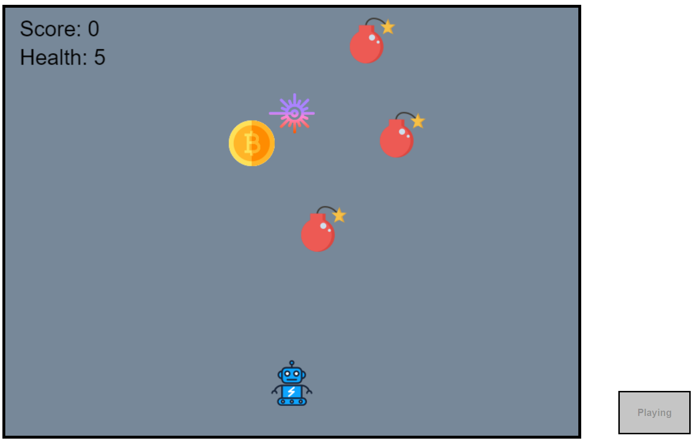

# CoinCollectGame

In this game, you move an avatar in a 2 dimensional space and **collect coins**. You must be aware of falling bombs; you'd better shoot them down fast.

## How to control the game

After you press **the "START GAME" button**, the game will begin. You can **move** your avatar using either **the arrow keys** or **the WASD keys**.
Pressing **the space bar** will **shoot a laser beam** of sorts which will eliminate the bombs, that is, if you actually hit them.

## Score and heath points

### Goal

Your goal is to collect as many coins as possible. Move your avatar to the coins using WASD or the arrow keys on your keyboard.

At the beginning of the game, you start out with a health value of **5**. Every time a bomb falls through to the bottom, you will **lose one health point**. If a bomb hits you directly, you will **lose two health points**. Every time you shoot a bomb down using your laser (press spacebar), you will **gain one health point**.

Try to **collect as many coins as possible** while shooting down all the bombs.

## Game over

Once your health points fall below zero, the game will end.
